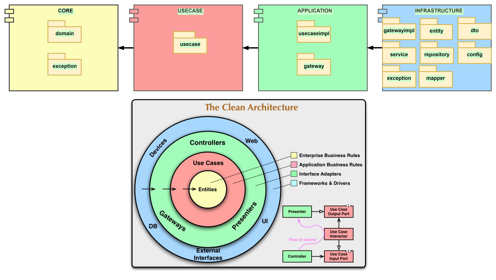
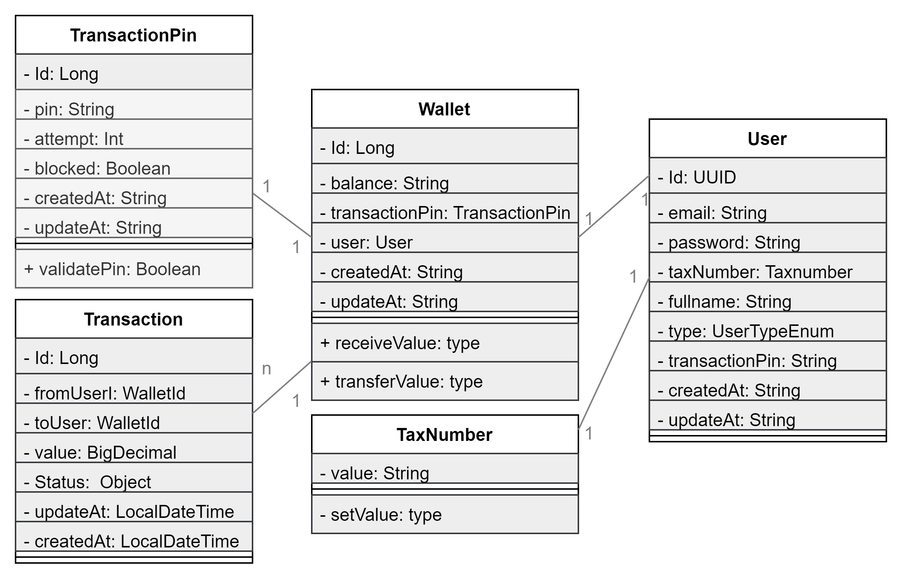
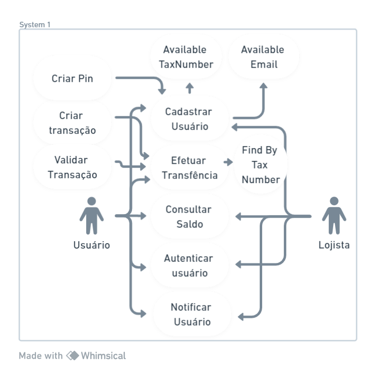

# Desafio-PicPay-Arquitetura-Limpa

ste projeto foi desenvolvido utilizando Java com Spring Boot, aplicando os princípios da Arquitetura Limpa (Clean Architecture), com foco em manutenibilidade, escalabilidade e baixo acoplamento.

## 🎯 Objetivo do Projeto

- Criar uma aplicação organizada e fácil de evoluir  
- Separar claramente regras de negócio de frameworks e tecnologias  
- Facilitar testes unitários e manutenção do código  
- Seguir boas práticas de engenharia de software

## 🧼 Arquitetura Utilizada – Clean Architecture

A aplicação está estruturada em camadas bem definidas: 

1. **Entity (Entidade)**:
    - Propósito: Representa as principais entidades ou objetos de domínio da aplicação, como objetos de negócios. Eles contêm apenas lógica relacionada ao domínio e não têm conhecimento de detalhes de implementação, como bancos de dados ou interfaces do usuário.
    - Dependências: Não deve depender de nenhuma outra camada, especialmente de detalhes técnicos.
2. **Use Case (Caso de Uso)**:
    - Propósito: Define os casos de uso da aplicação. Cada caso de uso é uma funcionalidade ou tarefa específica que a aplicação pode realizar. Ele contém a lógica de negócios e coordena a interação entre entidades.
    - Dependências: Pode depender de entidades, mas não deve depender diretamente de detalhes técnicos, como interfaces de usuário ou banco de dados.
3. **Interface and Adapter (Interface e Adaptador)**:
    - Propósito: Essa camada lida com a interação com o mundo exterior à aplicação, como interfaces de usuário, APIs externas ou bancos de dados. As interfaces definem os contratos que a aplicação precisa implementar, enquanto os adaptadores fornecem a implementação real para cumprir esses contratos.
    - Dependências: Pode depender de casos de uso e entidades, mas não deve depender de detalhes técnicos específicos, como frameworks.
4. **Framework (Framework)**:
    - Propósito: Esta camada contém detalhes técnicos e implementações concretas de frameworks, bibliotecas e componentes externos. Ela se comunica com o sistema operacional, bancos de dados, serviços web, etc.
    - Dependências: Pode depender das outras camadas da aplicação para fornecer funcionalidade específica, mas as camadas internas não devem depender diretamente dela.

A Arquitetura Limpa enfatiza a separação clara de responsabilidades entre essas camadas, com as camadas internas (entidades e casos de uso) sendo independentes das camadas externas (interfaces e adaptadores, e frameworks). Isso facilita a manutenção, testabilidade e evolução da aplicação, tornando-a mais escalável e adaptável às mudanças nos requisitos e nas tecnologias.

## 📦 Projeto

### Diagrama de Módulos e Pacotes

A estrutura do projeto segue os princípios da **Clean Architecture**, organizando o código em módulos bem definidos e com responsabilidades claras.

A divisão em camadas garante que as regras de negócio não dependam de frameworks ou detalhes externos, facilitando a manutenção, testes e evolução do sistema.

## 🧩 Diagrama de Classes (Domain)

O **Domain** representa o núcleo da aplicação, onde estão concentradas as **entidades** e as **regras de negócio**.  
Essa camada é totalmente independente de frameworks, banco de dados ou detalhes de infraestrutura.

As classes do domínio modelam os conceitos essenciais do negócio e se comunicam por meio de relacionamentos bem definidos, garantindo:
- Independência tecnológica  
- Alta coesão  
- Baixo acoplamento  
- Facilidade para testes unitários

## 👤 Diagrama de Caso de Uso

O diagrama de caso de uso representa as **interações entre os atores e o sistema**, evidenciando as principais funcionalidades disponíveis e os limites da aplicação.

Esse diagrama auxilia na compreensão dos requisitos funcionais do sistema, mostrando de forma clara:
- Os atores envolvidos  
- As funcionalidades oferecidas pelo sistema  
- O comportamento esperado a partir da perspectiva do usuário

## 🛠️ Ferramentas

As seguintes ferramentas foram utilizadas no desenvolvimento do projeto:

- **Java 17** – Linguagem principal utilizada no backend  
- **Spring Boot 4.0.0** – Framework para criação de aplicações Java  
- **Maven** – Gerenciador de dependências e build do projeto  
- **Git** – Controle de versão do código-fonte  
- **GitHub** – Hospedagem do repositório e versionamento  
- **H2 ** – Banco de dados (conforme ambiente)   
- **IntelliJ IDEA** – IDE utilizada no desenvolvimento  
- **Draw.io** – Criação dos diagramas UML  
    
